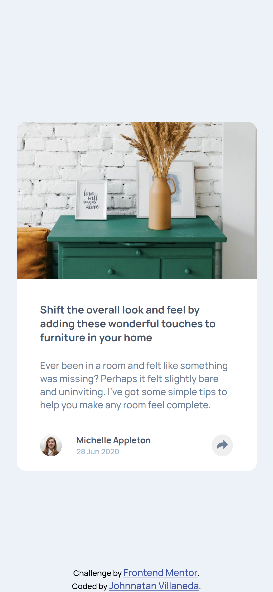
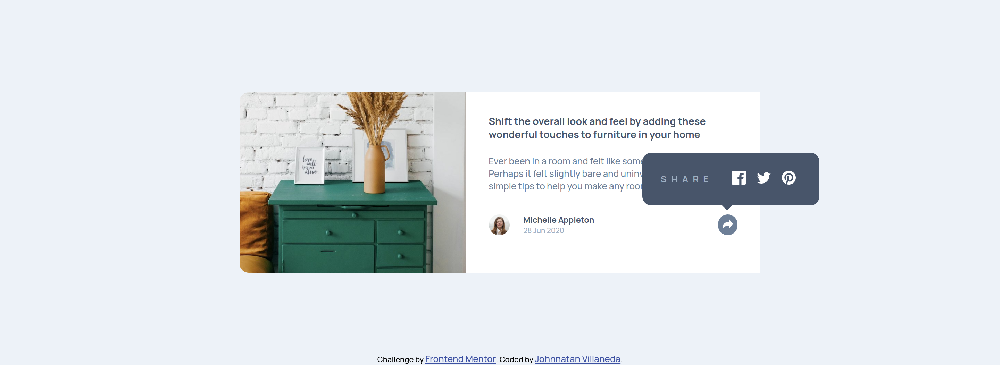

# Frontend Mentor - Article preview component solution

This is a solution to the [Article preview component challenge on Frontend Mentor](https://www.frontendmentor.io/challenges/article-preview-component-dYBN_pYFT). Frontend Mentor challenges help you improve your coding skills by building realistic projects.

## Table of contents

- [Overview](#overview)
  - [The challenge](#the-challenge)
  - [Screenshot](#screenshot)
  - [Links](#links)
- [My process](#my-process)
  - [Built with](#built-with)
  - [What I learned](#what-i-learned)
- [Author](#author)

## Overview

### The challenge

Users should be able to:

- View the optimal layout for the component depending on their device's screen size
- See the social media share links when they click the share icon

### Screenshot




### Links

- Solution URL: [Add solution URL here](https://github.com/JohnnatanV/article-preview)
- Live Site URL: [Add live site URL here](https://johnnatanv.github.io/article-preview/)

## My process

### Built with

- Semantic HTML5 markup
- CSS custom properties
- Flexbox
- CSS Grid
- Mobile-first workflow

### What I learned

I learn to use the tooltip for socia media links

```css
.tooltip {
  position: absolute;
  width: 60%;
  margin: auto;
  margin-top: -28%;
  margin-left: 60%;
  visibility: hidden;
  border-radius: 1rem;
  opacity: 0;

  transition: opacity 0.3s ease-in;
}

.tooltip::after {
  content: "";
  position: absolute;
  top: 93%;
  left: 46%;
  height: 10px;
  width: 10px;
  background-color: var(--main-text);
  transform: rotate(45deg);
}

.action {
  opacity: 1;
  visibility: visible;
  transition: opacity 0.3s ease-out;
}
```

```js
let action = () => {
  btn.addEventListener("click", () => {
    btn.classList.toggle("active");
    document.querySelector("#tooltip").classList.toggle("action");
  });
};
```

If you want more help with writing markdown, we'd recommend checking out [The Markdown Guide](https://www.markdownguide.org/) to learn more.

**Note: Delete this note and the content within this section and replace with your own learnings.**

## Author

- Website - [Johnnatan Villaneda](https://portfolio-cv-2u77x15g8-johnnatanv.vercel.app/)
- Frontend Mentor - [@JohnnatanV](https://www.frontendmentor.io/profile/JohnnatanV)
- Twitter - [@JohnnatanV](https://twitter.com/JohnnatanV)
